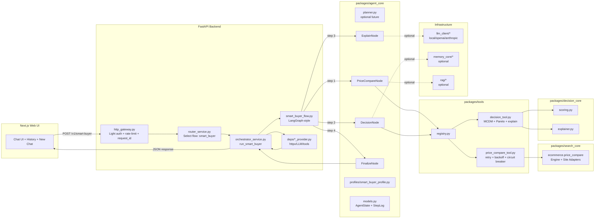
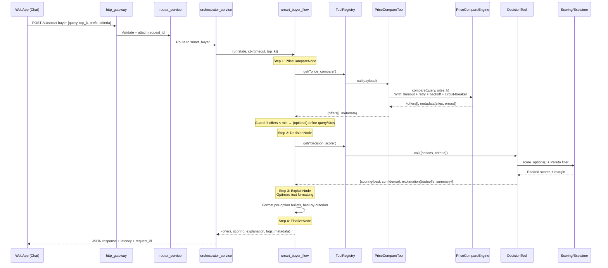

# Behavior Architecture - Smart Buyer MVP

**Comprehensive behavior documentation** showing:
- Component diagrams
- Sequence flows  
- Runtime behaviors (retry, timeout, guards, logging)
- Error handling and fallback strategies

---

## Table of Contents

1. [Component Architecture](#component-architecture)
2. [Sequence Diagram](#sequence-diagram)
3. [Key Behaviors](#key-behaviors)
4. [Error Handling & Fallbacks](#error-handling--fallbacks)
5. [End-to-End Flow](#end-to-end-flow)
6. [Layer-by-Layer Behavior](#layer-by-layer-behavior)
7. [Post-MVP Enhancements](#post-mvp-enhancements)

---

## Component Architecture
### Component Diagram



---

## Sequence Diagram

### Request Sequence Flow



---

## Key Behaviors

These are the **critical behaviors** that make your system robust:

### 1. **Timeout + Retry + Backoff + Circuit Breaker**
**Location**: `PriceCompareTool`

**Purpose**: Reduce hang-ups and load issues when web sources are slow or failing

```python
# Retry with exponential backoff
for attempt in range(max_retries + 1):
    try:
        result = await asyncio.wait_for(
            engine.compare(...),
            timeout=8.0  # Per-attempt timeout
        )
        return result
    except asyncio.TimeoutError:
        if attempt < max_retries:
            await asyncio.sleep(2.5 * (2 ** attempt))  # Exponential backoff

# Circuit breaker
if self._failures >= 5:
    self._circuit_open_until = now + 30
    return {"offers": [], "error": "circuit_open"}
```

### 2. **Guards in Flow** (State-First Validation)
**Location**: `SmartBuyerFlow`

**Purpose**: Handle edge cases gracefully

```python
# Guard: Insufficient offers
if len(state.facts.get("offers", [])) < minimum_threshold:
    # Option 1: Expand sources
    sites = ["shopee", "lazada", "tiki"]  # Add more sites
    
    # Option 2: Adjust criteria
    # (Future enhancement)
```

### 3. **MCDM Decision v1**
**Location**: `DecisionTool` → `decision_core`

**Algorithm**:
1. **Pareto Filter** - Remove dominated options
2. **Min-Max Normalize** - Scale all criteria to [0,1]
3. **Weighted Sum** - Calculate total score
4. **Confidence** - Based on score margin (top1 - top2)

```python
# Pareto filtering
non_dominated = pareto_filter(options, criteria)

# Normalization & scoring
for option in non_dominated:
    normalized_scores = min_max_normalize(option, criteria)
    total_score = sum(weight_i * normalized_scores[i])

# Confidence from margin
confidence = (top1_score - top2_score) / top1_score
```

### 4. **Explain v1** (Rule-Based)
**Location**: `ExplainNode`

**Current**: Rule-based (no LLM required for MVP)  
**Future**: Can "naturalize" with LLM after MVP stabilizes

```python
# Rule-based explanation
explanation = {
    "tradeoffs": generate_tradeoffs(top_options),
    "best_by_criterion": find_best_per_criterion(options, criteria),
    "summary": build_summary(winner, confidence)
}
```

### 5. **Observability** (Request ID + Logging)
**Location**: Throughout entire stack

**Tracked**:
- `request_id` flows through all layers
- `step_latency` per node
- `offers_count` at each stage
- `score_margin` (confidence indicator)
- `site_errors` in metadata

```python
# Every node logs
state.add_log(
    kind="price_compare",
    step="run",
    latency_ms=234,
    input={"query": "iPhone 15"},
    output={"offers_count": 6},
    error=None
)
```

### 6. **Fail-Soft** (Stable Envelopes)
**Location**: All tools, engines, and orchestrator

**Principle**: Every component returns stable envelope - **API never crashes**

```python
# Always return valid structure, even on error
{
    "offers": offers or [],
    "scoring": scoring or _empty_scoring(),
    "explanation": explanation or _empty_explanation(),
    "metadata": {"error": error_msg if error else None}
}
```

---

## Error Handling & Fallbacks

### Failure Scenarios & Responses

#### **Scenario 1: Engine Error/Timeout**
```
PriceCompareEngine fails/times out
    ↓
PriceCompareTool returns: {offers=[], metadata.error}
    ↓
Flow continues
    ↓
Returns explanation: "No data available"
```

#### **Scenario 2: Scoring Error**
```
Scoring logic fails
    ↓
DecisionTool returns: _empty_result() with stable structure
    ↓
Flow continues
    ↓
Returns: Offers without ranking
```

#### **Scenario 3: LLM Disabled**
```
LLM provider = local (or unavailable)
    ↓
Explainer runs rule-based logic normally
    ↓
Returns: Structured explanation without natural language enhancement
```

#### **Scenario 4: Budget Exceeded**
```
state.spent_tokens >= state.budget_tokens
    ↓
Flow terminates early
    ↓
Returns: Partial results with "budget_exceeded" flag
```

---

## Post-MVP Enhancements

### Phase B Enhancements (After MVP Works)

#### **1. Add Real Site Adapters**
**Location**: `packages/search_core/ecommerce/sites/`

```python
# Replace mock adapters with real implementations
├── shopee.py      # Real Shopee scraping/API
├── lazada.py      # Real Lazada scraping/API  
├── tiki.py        # Real Tiki scraping/API
└── tiktok.py      # Real TikTok Shop

# Keep Engine.compare() contract unchanged
```

#### **2. Enable Tool-Level Caching**
**Location**: `PriceCompareTool`

**When**: After Redis is available

```python
@cached(ttl_seconds=300)  # 5 minutes
async def call(self, payload):
    # Cache key: hash(query + prefs)
    # Prevents hammering sites during demos
    ...
```

#### **3. Enable LLM for ExplainNode**
**Location**: `ExplainNode`

```python
# Respect timeout and token policy
if llm_available and tokens_remaining > 500:
    explanation = await llm.complete(
        system="You are a shopping advisor...",
        user=f"Explain these products: {top_3}"
    )
else:
    explanation = rule_based_explanation(top_3)
```

#### **4. Add Policy Guards**
**Location**: `Orchestrator`

```python
# In orchestrator_service.py
policies = [
    MaxStepsPolicy(max_steps=8),
    TokenBudgetPolicy(budget=5000),
    LatencyPolicy(max_latency_s=10)
]

# Before each step
for policy in policies:
    if not policy.check(state):
        state.mark_done({"reason": policy.violation_reason})
```

---


## End-to-End Flow

### Complete Request Journey (Browser → Results)

```
┌────────────────────────────────────────────────────────────────┐
│ 1. User (Browser / web-app)                                    │
│    Types: "So sánh giá iPhone 15"                              │
└────────────────────────────┬───────────────────────────────────┘
                             │
                             ▼
┌────────────────────────────────────────────────────────────────┐
│ 2. Web App (Next.js)                                           │
│    POST /v1/smart-buyer                                        │
│    {query: "iPhone 15", top_k: 5}                              │
└────────────────────────────┬───────────────────────────────────┘
                             │
                             ▼
┌────────────────────────────────────────────────────────────────┐
│ 3. API Gateway (FastAPI - http_gateway.py)                    │
│    - Validate request                                          │
│    - Generate/attach request_id                                │
│    - Rate limiting                                             │
└────────────────────────────┬───────────────────────────────────┘
                             │
                             ▼
┌────────────────────────────────────────────────────────────────┐
│ 4. Router Service (router_service.py)                         │
│    Detect intent → Select smart_buyer flow                     │
└────────────────────────────┬───────────────────────────────────┘
                             │
                             ▼
┌────────────────────────────────────────────────────────────────┐
│ 5. OrchestratorService.run_smart_buyer()                      │
│    - Build AgentState                                          │
│    - Create flow context                                       │
│    - Execute with timeout                                      │
└────────────────────────────┬───────────────────────────────────┘
                             │
                             ▼
┌────────────────────────────────────────────────────────────────┐
│ 6. SmartBuyerFlow (LangGraph-style)                           │
│    Sequential execution:                                       │
│    PriceCompare → Decision → Explain → Finalize                │
│                                                                │
│    • Nodes call Tools via ToolRegistry                         │
│    • Tools call Engines (search_core)                          │
│    • DecisionTool + Explainer return scoring + explanation     │
└────────────────────────────┬───────────────────────────────────┘
                             │
                             ▼
┌────────────────────────────────────────────────────────────────┐
│ 7. Orchestrator Normalizes Response                           │
│    - Add metadata (latency, request_id, flow)                  │
│    - Format to SmartBuyerResponse schema                       │
└────────────────────────────┬───────────────────────────────────┘
                             │
                             ▼
┌────────────────────────────────────────────────────────────────┐
│ 8. http_gateway Returns JSON to web-app                       │
└────────────────────────────┬───────────────────────────────────┘
                             │
                             ▼
┌────────────────────────────────────────────────────────────────┐
│ 9. Web App Renders UI                                         │
│    - Offers list (product cards)                               │
│    - Reasoning/explanation                                     │
│    - Recommended option highlighted                            │
└────────────────────────────────────────────────────────────────┘
```

---

## Layer-by-Layer Behavior

### Layer 1: Web App (Frontend) Behavior

**User Action**: Types "tìm iPhone 13 128GB giá tốt"

**Frontend Behavior:**

#### **Step 1: Session Management**
```typescript
// Get current session or create new one
const sessionId = getCurrentSession() || createNewSession();
```

#### **Step 2: Send Request**
```typescript
POST /v1/smart-buyer
{
  "query": "iPhone 13 128GB",
  "top_k": 5,
  "prefs": { 
    "budget": 11000000, 
    "required_tags": ["official"] 
  },
  "criteria": [
    {"name": "price", "weight": 0.4, "maximize": false},
    {"name": "rating", "weight": 0.6, "maximize": true}
  ]
}
```

#### **Step 3: Process Response**
```typescript
// Map response to UI
offers → Product cards list
scoring.best → Highlight best option
explanation.summary + tradeoffs → Recommendation text
```

#### **Step 4: Update UI**
```typescript
// Display results
renderProductCards(offers);
highlightBestOption(scoring.best);
showExplanation(explanation.summary);

// Save to chat history
saveChatHistory(sessionId, {
    query: "iPhone 13 128GB",
    response: explanation.summary,
    offers: offers
});
```

---

### Layer 2: HTTP Gateway Behavior

**File**: `apps/api/src/api/routes/smart_buyer.py`

#### **Step 1: Receive & Validate**
```python
# Parse JSON into Pydantic model
req = SmartBuyerRequest(
    query="iPhone 13 128GB",
    top_k=5,
    prefs=...
)
# Automatic validation
```

#### **Step 2: Logging**
```python
logger.info("Smart buyer request received", extra={
    "query": req.query,
    "top_k": req.top_k,
    "request_id": x_request_id,
    "client_ip": request.client.host
})
```

#### **Step 3: Dependency Injection**
```python
# FastAPI automatically injects:
svc: OrchestratorService = Depends(OrchestratorService)
tools: ToolRegistry = Depends(get_tool_registry)
llm: ILLMClient = Depends(get_llm)
http: AsyncClient = Depends(get_http_client)
```

#### **Step 4: Call Orchestrator**
```python
result = await svc.run_smart_buyer(
    query=req.query,
    top_k=req.top_k,
    prefs=req.prefs.model_dump() if req.prefs else None,
    criteria=[c.model_dump() for c in req.criteria] if req.criteria else None,
    tools=tools,
    llm=llm,
    http=http,
    request_id=x_request_id or gen_request_id(),
)
```

#### **Step 5: Return Response**
```python
# Wrap in Response model
return SmartBuyerResponse(
    request_id=rid,
    query=req.query,
    latency_ms=latency_ms,
    offers=offers,
    scoring=scoring,
    explanation=explanation,
    metadata=metadata
)
# Status: Usually 200 OK, even with logic errors (use metadata.error)
```

---

**Note**: This section was already translated in Layer 2 above. Removing duplicate.

### Layer 3: Orchestrator Behavior

**File**: `apps/api/src/services/orchestrator_service.py`

#### **OrchestratorService.run_smart_buyer()**

**Step 1: Quick Validation**
```python
# Reject invalid queries early
if len(query.strip()) < 2:
    return self._error_response(
        request_id,
        reason="query too short",
        extra={"offers": [], "scoring": _empty_scoring()}
    )
```

**Step 2: Initialize AgentState**
```python
state = AgentState(
    session_id=request_id,
    query=query,
    facts={
        "prefs": prefs or {},
        "criteria": criteria or [],
    },
    logs=[],
    budget_tokens=16000,  # Default budget
    spent_tokens=0,
    done=False,
)
```

**Step 3: Create Flow**
```python
flow = SmartBuyerFlow(
    tools=tools,
    llm=llm,
    memory=self.memory,
    default_timeout_s=20.0
)

ctx = {
    "top_k": top_k,
    "request_id": request_id,
    "timeout_s": timeout_s or 20.0
}
```

**Step 4: Execute with Timeout**
```python
try:
    result = await asyncio.wait_for(
        flow.run(state, ctx),
        timeout=ctx["timeout_s"]
    )
except asyncio.TimeoutError:
    logger.warning("Smart buyer timeout", extra={"request_id": request_id})
    return self._error_response(request_id, "timeout")
except Exception as e:
    logger.exception("Smart buyer error", extra={"request_id": request_id})
    return self._error_response(request_id, type(e).__name__)
```

**Step 5: Attach Metadata**
```python
# Add telemetry
result["metadata"]["latency_ms"] = latency_ms
result["metadata"]["flow"] = "smart_buyer"
result["metadata"]["request_id"] = request_id

# Return stable JSON
return result
```

---

### Layer 4: SmartBuyerFlow Behavior (LangGraph-Style)

**File**: `apps/api/src/router/flows/smart_buyer_flow.py`

#### **Flow Definition**
Sequential node chain:
```
PriceCompareNode → DecisionNode → ExplainNode → FinalizeNode
```

---

#### **Node 1: PriceCompareNode**

**Input:**
- `AgentState` with query
- `ctx.top_k`
- `state.facts["prefs"]`
- Optional: `sites` filter

**Behavior:**
```python
# Call price compare tool
offers_result = await tools.call("price_compare", {
    "query": state.query,
    "top_k": ctx["top_k"],
    "prefs": state.facts.get("prefs", {}),
    "sites": prefs.get("sites") or ["shopee", "lazada"]
})

# Extract results
offers = offers_result.get("offers", [])
metadata = offers_result.get("metadata", {})

# Update state
state.facts["offers"] = offers
state.facts["price_compare_metadata"] = metadata
```

**Output**: `state.facts["offers"]` populated with products

---

#### **Node 2: DecisionNode**

**Input:**
- `state.facts["offers"]` (from previous node)
- `criteria` (from profile or user)
- `prefs` (user preferences)

**Behavior:**
```python
# Call decision tool
decision_result = await tools.call("decision_score", {
    "options": state.facts["offers"],
    "criteria": state.facts.get("criteria", []),
    "prefs": state.facts.get("prefs", {})
})

# Extract scoring and explanation
scoring = decision_result.get("scoring", {})
explanation_raw = decision_result.get("explanation", {})

# Update state
state.facts["scoring"] = scoring
state.facts["explanation_raw"] = explanation_raw
```

**Output**: 
- `state.facts["scoring"]` - Ranked options with confidence
- `state.facts["explanation_raw"]` - Initial trade-off analysis

---

#### **Node 3: ExplainNode**

**Input:**
- `state.facts["offers"]`
- `state.facts["scoring"]`

**Behavior:**
```python
# Option 1: Refine with LLM (future)
if llm_enabled:
    explanation = await llm.complete(
        system="You are a shopping advisor...",
        user=f"Explain these options: {top_3}"
    )
else:
    # Option 2: Rule-based (MVP)
    explanation = self._rule_based_explanation(offers, scoring)

# Normalize explanation shape
normalized = {
    "winner": explanation.get("winner"),
    "tradeoffs": explanation.get("tradeoffs", []),
    "per_option": explanation.get("per_option", []),
    "summary": explanation.get("summary", "")
}

# Update state
state.facts["explanation"] = normalized
```

**Output**: `state.facts["explanation"]` - Complete, formatted explanation

---

#### **Node 4: FinalizeNode**

**Input:**
- `state.facts["offers"]`
- `state.facts["scoring"]`
- `state.facts["explanation"]`

**Behavior:**
```python
# Build final output envelope
output = {
    "offers": state.facts.get("offers", []),
    "scoring": state.facts.get("scoring", {}),
    "explanation": state.facts.get("explanation", {}),
    "metadata": {
        "step_idx": state.step_idx,
        "offers_count": len(state.facts.get("offers", [])),
        "request_id": ctx.get("request_id")
    }
}

# Mark completion
state.mark_done(output)
```

**Output**: Complete response ready to return

**Flow Result**: `flow.run(...)` returns final dict → Orchestrator → http_gateway → web-app

---

### Layer 5: Tools & Engine Behavior

#### **5.1 ToolRegistry**

**File**: `packages/tools/tools/registry.py`

**State**: Maintains tool map
```python
{
  "price_compare": PriceCompareTool(...),
  "decision_score": DecisionTool(...)
}
```

**Behavior**: When node calls
```python
result = await registry.call("price_compare", payload)
# Looks up tool and executes it
```

---

#### **5.2 PriceCompareTool Behavior**

**File**: `packages/tools/tools/price_compare_tool.py`

**Step 1: Validate & Normalize Payload**
```python
query, top_k, prefs, sites = self._parse_payload(payload)
```

**Step 2: Circuit Breaker Check**
```python
# If many failures → open circuit → return empty
if self._circuit_open():
    return {"offers": [], "metadata": {"error": "circuit_open"}}
```

**Step 3: Retry Loop with Backoff**
```python
for attempt in range(max_retries + 1):
    try:
        result = await asyncio.wait_for(
            engine.compare(query=query, top_k=top_k, prefs=prefs, sites=sites),
            timeout=8.0
        )
        return result
    except asyncio.TimeoutError:
        if attempt < max_retries:
            await asyncio.sleep(2.5 * (2 ** attempt))  # Exponential backoff
```

**Step 4: Normalize Output (Fail-Soft)**
```python
# Never throws exceptions, always returns dict
{
    "offers": [...],
    "metadata": {
        "latency_ms": ...,
        "circuit_open": False,
        "attempts": 2
    }
}
```

---

#### **5.3 PriceCompareEngine Behavior**

**File**: `packages/search_core/search_core/ecommerce/price_compare.py`

**Input**: `query, top_k, prefs, sites`

**Step 1: Fan-Out to Site Adapters**
```python
# Parallel execution to all sites
results = {}
errors = {}

async def _run_site(site):
    adapter = get_site_adapter(site)  # ShopeeMock, LazadaMock, etc.
    try:
        res = await asyncio.wait_for(
            adapter.search(query=query, prefs=prefs, limit=top_k),
            timeout=6.0
        )
        results[site] = res
    except Exception as e:
        errors[site] = str(e)
        results[site] = []

await asyncio.gather(*[_run_site(s) for s in sites])
```

**Step 2: Normalize Each Offer**
```python
# Standardize: title, price, currency → VND, seller_rating, shipping
normalized_offer = {
    "title": offer["title"],
    "price": convert_to_vnd(offer["price"]),
    "currency": "VND",
    "seller_rating": offer.get("rating", 0),
    "shipping": offer.get("shipping_fee", 0),
    ...
}
```

**Step 3: Canonicalize**
```python
# Extract: brand, model, variant
canonical = _canonicalize_title(title, attributes)
# Returns: {"brand": "Apple", "model": "iPhone 15", "variant": "128GB"}
offer["canonical"] = canonical
```

**Step 4: Deduplicate**
```python
# By canonical key, merge attributes
fused_offers = _fuse_duplicates(raw_offers)
```

**Step 5: Sort**
```python
# Sorting priority:
# 1. In-stock first
# 2. Lower effective_price (price + shipping)
# 3. Higher seller_rating

fused_offers.sort(key=lambda x: (
    not x.get("in_stock", True),      # In-stock first
    x.get("effective_price", 1e18),   # Lower price
    -x.get("seller_rating", 0.0)      # Higher rating
))
```

**Step 6: Return Top-K**
```python
return {
    "offers": fused_offers[:top_k],
    "metadata": {
        "queried_sites": sites,
        "latency_ms": ...,
        "errors": errors  # Per-site errors
    }
}
```

---

#### **5.4 DecisionTool Behavior**

**File**: `packages/tools/tools/decision_tool.py`

**Input**: `options (offers) + criteria`

**Step 1: Pareto Filter (Optional)**
```python
# Remove dominated options
# Option A dominates B if A is better on all criteria
non_dominated = pareto_filter(options, criteria)
```

**Step 2: Multi-Criteria Scoring**
```python
# Calculate scores
scoring_result = Scoring.score_options(
    options=non_dominated,
    criteria=criteria,
    normalize=True
)
# Returns: total_score, rank, criterion_scores per option
```

**Step 3: Estimate Confidence**
```python
# Based on margin between top1 and top2
top1_score = scores[0].total_score
top2_score = scores[1].total_score if len(scores) > 1 else 0

confidence = (top1_score - top2_score) / top1_score
```

**Step 4: Generate Explanation**
```python
# Create trade-offs and reasoning
explanation = Explainer.compare_options(
    options=top_options,
    scoring=scoring_result
)
# Returns: trade-offs, best_by_criterion, summary
```

**Step 5: Return Result**
```python
return {
    "scoring": {
        "best": best_option_id,
        "confidence": confidence,
        "option_scores": ranked_scores
    },
    "explanation": {
        "winner": winner_name,
        "tradeoffs": tradeoffs,
        "best_by_criterion": best_per_criterion,
        "summary": summary_text
    }
}
```

---

### Layer 6: Memory & LLM Behavior

#### **Current State (MVP)**

**LLM:**
- Has `ILLMClient` + `LocalClient` 
- Not heavily used in flow yet (Explainer is rule-based)
- Can be enhanced in Phase B

**Memory:**
- Has `IMemory` interface
- SmartBuyerFlow doesn't depend on it yet
- Can be added incrementally:
  - Save last winner per session
  - Persist user preferences
  - Track search history

---

#### **Future Enhancements**

**1. Add Planner/Router/Critic Nodes**

```python
# Planner Node - Choose appropriate flow
plan = await planner.plan(state)
if plan.intent == "price_compare":
    flow = SmartBuyerFlow
elif plan.intent == "deep_research":
    flow = DeepSearchFlow
else:
    flow = NormalChatFlow

# Critic Node - Validate results
critic_result = await critic.check(state.output)
if critic_result.is_spam or critic_result.out_of_domain:
    state.mark_done({"error": "invalid_output"})

# Memory Node - Retrieve context
past_prefs = await memory.retrieve(
    session_id=state.session_id,
    query="user_preferences"
)
state.facts["user_prefs"] = past_prefs
```

---

## One-Sentence Summary

**User types query in web-app** → **API Gateway receives request and routes to SmartBuyer flow** → **Orchestrator creates AgentState and runs node chain** (PriceCompare → Decision → Explain → Finalize) → **Each node uses Tools; tools call Engines** (mock Shopee/Lazada, scoring, explainer) → **Results are normalized and returned to web-app** → **Displays product list + purchase reasoning**.

---

## Behavior Architecture Diagram (Complete)

```
┌──────────────────────────────────────────────────────────────┐
│                     Behavior Flow Summary                     │
└──────────────────────────────────────────────────────────────┘

User Input: "So sánh giá iPhone 15"
    ↓
┌──────────────────────────────────────────────────────────────┐
│ 1. Frontend (Next.js)                                        │
│    Behavior: Session management → Build request → Send HTTP │
└────────────────────────┬─────────────────────────────────────┘
                         │
                         ▼
┌──────────────────────────────────────────────────────────────┐
│ 2. API Gateway (FastAPI)                                     │
│    Behavior: Validate → Log → Inject deps → Route           │
└────────────────────────┬─────────────────────────────────────┘
                         │
                         ▼
┌──────────────────────────────────────────────────────────────┐
│ 3. Orchestrator                                              │
│    Behavior: Build state → Create flow → Execute + timeout  │
└────────────────────────┬─────────────────────────────────────┘
                         │
                         ▼
┌──────────────────────────────────────────────────────────────┐
│ 4. SmartBuyerFlow (LangGraph)                                │
│    Behavior: Sequential node execution                       │
│    ┌──────────────────────────────────────────────────────┐ │
│    │ PriceCompareNode                                     │ │
│    │   → Call tool → Engine → Site adapters              │ │
│    │   → Retry + Timeout + Circuit breaker               │ │
│    │   → Normalize → Dedupe → Sort                       │ │
│    └────────────────┬─────────────────────────────────────┘ │
│                     ▼                                        │
│    ┌──────────────────────────────────────────────────────┐ │
│    │ DecisionNode                                         │ │
│    │   → Pareto filter (remove dominated)                │ │
│    │   → Multi-criteria scoring                          │ │
│    │   → Calculate confidence (margin)                   │ │
│    │   → Generate trade-offs                             │ │
│    └────────────────┬─────────────────────────────────────┘ │
│                     ▼                                        │
│    ┌──────────────────────────────────────────────────────┐ │
│    │ ExplainNode                                          │ │
│    │   → Rule-based explanation (MVP)                    │ │
│    │   → Or LLM-enhanced (Phase B)                       │ │
│    └────────────────┬─────────────────────────────────────┘ │
│                     ▼                                        │
│    ┌──────────────────────────────────────────────────────┐ │
│    │ FinalizeNode                                         │ │
│    │   → Assemble output                                 │ │
│    │   → Add metadata                                    │ │
│    │   → Mark done                                       │ │
│    └──────────────────────────────────────────────────────┘ │
└────────────────────────┬─────────────────────────────────────┘
                         │
                         ▼
┌──────────────────────────────────────────────────────────────┐
│ 5. Return to Client                                          │
│    Behavior: Format response → Send JSON → Render UI        │
└──────────────────────────────────────────────────────────────┘
```

---

## Key Behavioral Patterns

### 1. **Resilience Patterns**

| Pattern | Implementation | Benefit |
|---------|----------------|---------|
| **Timeout** | `asyncio.wait_for(task, timeout=8.0)` | Prevents hanging |
| **Retry** | `for attempt in range(max_retries)` | Handles transient errors |
| **Backoff** | `sleep(base * 2^attempt)` | Reduces load spike |
| **Circuit Breaker** | `if failures >= 5: open_circuit()` | Prevents cascade failures |
| **Fail-Soft** | Always return valid dict | API never crashes |

### 2. **Observability Patterns**

| What | Where | How |
|------|-------|-----|
| **Request Tracing** | All layers | `request_id` flows through |
| **Step Logging** | Each node | `state.add_log(kind, step, latency)` |
| **Metrics** | Tools & Orchestrator | Count, latency, success rate |
| **Error Tracking** | All components | Log + metadata.error |

### 3. **State Management Patterns**

```python
# Read from state
offers = state.facts.get("offers", [])

# Write to state  
state.facts["scoring"] = scoring

# Check state
if state.done or state.budget_exceeded():
    break
```

### 4. **Guard Patterns**

```python
# Guard 1: Empty results
if len(offers) == 0:
    return _empty_response()

# Guard 2: Budget exceeded
if state.spent_tokens >= state.budget_tokens:
    state.mark_done({"reason": "budget_exceeded"})

# Guard 3: Timeout approaching
if elapsed_time > 0.8 * timeout:
    return partial_results
```

---

## Runtime Behavior Timeline

```
T=0ms     : Request received at gateway
T=5ms     : Validation complete, deps injected
T=10ms    : Orchestrator builds state
T=15ms    : Flow starts, PriceCompareNode begins
T=20ms    : Tool call to price_compare
T=250ms   : Engine completes (fan-out to sites)
T=260ms   : DecisionNode starts
T=350ms   : Scoring complete, confidence calculated
T=360ms   : ExplainNode starts
T=400ms   : Explanation generated (rule-based)
T=410ms   : FinalizeNode assembles response
T=420ms   : Flow returns to orchestrator
T=430ms   : Metadata attached
T=435ms   : Response sent to client
T=450ms   : UI updated with results

Total: ~450ms (without LLM)
Total: ~2000ms (with LLM explanation)
```

---

## Summary: Behavior Architecture at a Glance

### **Request Journey**
```
Browser → Next.js → FastAPI → Router → Orchestrator → Flow → Nodes → Tools → Engines → Results
```

### **Key Behaviors**
- ✅ **Resilient**: Retry, timeout, circuit breaker, fail-soft
- ✅ **Observable**: Request ID, logging, metrics at every layer
- ✅ **Controlled**: Budget limits, timeout limits, guard conditions
- ✅ **Modular**: Each layer has clear responsibility
- ✅ **Testable**: DI makes every component mockable

### **What Makes This Production-Grade**

1. **Never crashes** - Fail-soft at every level
2. **Always traceable** - request_id flows through all layers
3. **Budget-aware** - Token limits prevent runaway costs
4. **Performance-tuned** - Parallel execution, caching, timeouts
5. **User-focused** - Clear explanations, trade-offs, recommendations

---

## Related Documentation

- **Architecture**: `ARCHITECTURE.md` - High-level system design
- **Data Flow**: `DATAFLOW.md` - Request data transformations
- **Core Concepts**: `12_concepts.md` - Fundamental principles
- **Run Guide**: `RUN_GUIDE.md` - How to run the system
- **Fixes**: `FIXES_FOR_LANGGRAPH_ORCHESTRATOR.md` - Bug fixes needed

---

**Last Updated**: November 20, 2024  
**For**: Production-Grade AI Agent Architecture  
**Framework**: LangGraph-Style Multi-Agent Reasoning

