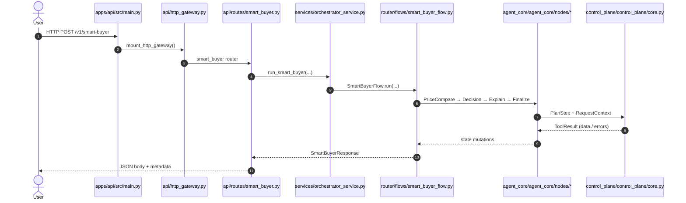
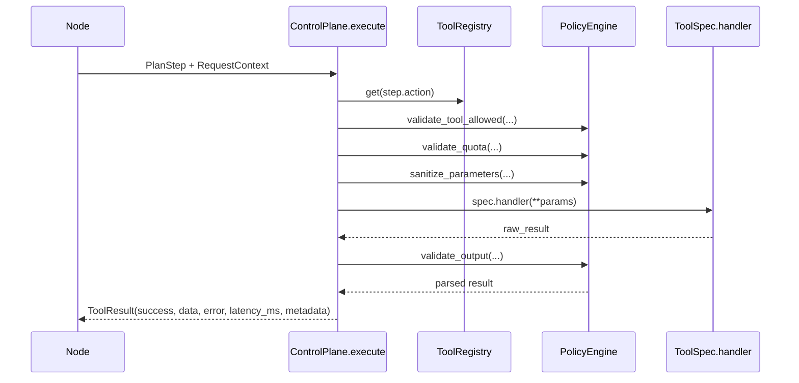

# QuantumX AI – Runtime Flow Map

This reference explains how Smart Buyer requests flow through the platform (HTTP + CLI) and how the ControlPlane coordinates tool calls. Paths are relative to `quantumx-ai/`.

---

## Overview
- Both HTTP and CLI traffic converge on `OrchestratorService.run_smart_buyer`.
- `SmartBuyerFlow` executes an ordered set of nodes that mutate shared `AgentState`.
- Nodes rely on the ControlPlane for tool execution, policy, schema, and quota enforcement.

---

## HTTP Smart Buyer Request

### Sequence Diagram


### Execution Path
1. **FastAPI bootstrap** (`apps/api/src/main.py`) – loads env vars, installs middleware, and mounts `api/http_gateway.py` under `/v1`.
2. **HTTP gateway** (`api/http_gateway.py`) – lazily loads routers and dispatches `/v1/smart-buyer` to the Smart Buyer router.
3. **Route handler** (`api/routes/smart_buyer.py::smart_buyer`) – validates `SmartBuyerRequest`, extracts org/user headers, resolves dependencies (registry, LLM, HTTP client, orchestrator), and invokes `run_smart_buyer`.
4. **Orchestrator service** (`services/orchestrator_service.py::run_smart_buyer`) – builds `AgentState`, enriches metadata (org/user/top_k/sites/timeout), instantiates `SmartBuyerFlow`, and awaits `flow.run(...)`, then normalizes the response.
5. **SmartBuyerFlow** (`router/flows/smart_buyer_flow.py`) – uses `agent_core.agent_core.planner.build_initial_plan`, iterates nodes with budget/timeout tracking, and aggregates latency metadata.
6. **Nodes** (`packages/agent_core/agent_core/nodes/*.py`) – mutate shared state, optionally call tools via the ControlPlane, and store resulting facts/metadata.
7. **ControlPlane** (`control_plane/control_plane/core.py`) – resolves tool specs, runs policy/quota checks, executes handlers, and returns `ToolResult` objects.
8. **Tool execution** (e.g., `price_compare`) – registered in `packages/tools/control_plane/price_compare_tool.py`, which calls `search_core/.../PriceCompareEngine`; results flow back to the node → flow → HTTP response.

### Node Responsibilities
- **PriceCompareNode** – reads `state.facts["query"]`, emits `PlanStep("price_compare")`, and stores normalized offers plus latency metadata.
- **DecisionNode** – currently calls `decision_score` directly through the ToolRegistry to score offers and outline the explanation payload.
- **ExplainNode** – local enrichment step that finalizes the explanation narrative.
- **FinalizeNode** – composes the response envelope, stamps completion metadata, and ends the flow.

---

## ControlPlane Internals



- `PolicyStore` (in `control_plane/control_plane/policy.py`) defines global/org/role policies and quota rules.
- `bootstrap.py` wires the `ToolRegistry`, `PolicyEngine`, and ControlPlane singleton, which is exposed via `apps/api/src/dependencies/control_plane_provider.py`.

---

## CLI Flow (`apps/api/src/cli/run_smart_buyer.py`)

```mermaid
flowchart TD
    A[CLI python run_smart_buyer.py --query ...] --> B[Parse args JSON (prefs, criteria)]
    B --> C[get_tool_registry / get_llm / http client / control_plane]
    C --> D[OrchestratorService(control_plane)]
    D --> E[run_smart_buyer (shared path)]
    E --> F[Print JSON response]
```

- CLI defaults headers such as `channel="cli"`, then shares the exact orchestrator + flow path used by HTTP traffic.

---

## File / Component Reference (Smart Buyer MVP)
| Layer | File | Primary Symbols | Purpose |
| --- | --- | --- | --- |
| HTTP app | `apps/api/src/main.py` | `create_app`, `mount_http_gateway` | Boot FastAPI and mount routers. |
| Routing | `apps/api/src/api/routes/smart_buyer.py` | `smart_buyer` | Validate request, resolve deps, call orchestrator. |
| Dependency injection | `apps/api/src/dependencies/*.py` | `get_control_plane`, `get_orchestrator_service`, ... | Provide shared registry, ControlPlane, services. |
| Service | `apps/api/src/services/orchestrator_service.py` | `OrchestratorService.run_smart_buyer` | Build `AgentState`, run flow, normalize response. |
| Flow | `apps/api/src/router/flows/smart_buyer_flow.py` | `SmartBuyerFlow.build/run` | Execute plan with budget/timeout tracking. |
| Nodes | `packages/agent_core/agent_core/nodes/*.py` | `PriceCompareNode`, `DecisionNode`, `ExplainNode`, `FinalizeNode` | Mutate agent state and invoke tools. |
| ControlPlane | `packages/control_plane/control_plane/core.py` | `ToolRegistry`, `ToolSpec`, `ControlPlane.execute` | Resolve specs and run tools with policy checks. |
| Policy | `packages/control_plane/control_plane/policy.py` | `PolicyEngine`, `PolicyStore`, `QuotaLimits` | Enforce tool access, quotas, and schema validation. |
| Tools | `packages/tools/control_plane/price_compare_tool.py` | `register_price_compare_tool` | Register price-compare handler + schema. |
| E-commerce | `packages/search_core/search_core/ecommerce/price_compare_service.py` | `PriceCompareEngine` | Mock adapters (Shopee/Lazada) returning offers. |
| CLI | `apps/api/src/cli/run_smart_buyer.py` | `main` | Invoke the same flow locally. |

---

## Key Takeaways
- All Smart Buyer traffic funnels through `OrchestratorService.run_smart_buyer` and `SmartBuyerFlow.run`.
- Nodes should invoke tools through the ControlPlane; `DecisionNode` is the next candidate for full migration.
- Policy, quota, and schema enforcement live in `control_plane/control_plane`.
- Adding a tool requires registering a `ToolSpec` and referencing it from the relevant node plan.
